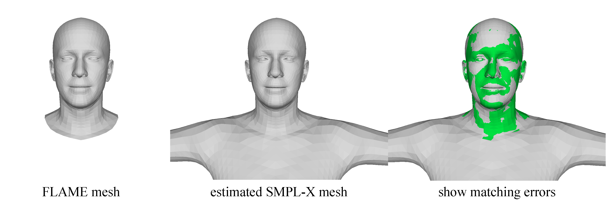

## FLAME2SMPLX

A tools to estimate SMPL-X parameters (with T pose) from FLAME meshes (or FLAME parameters), which is used in [MeGA](https://github.com/conallwang/MeGA/tree/master). The project is modified based on the official [SMPL-X repo](https://github.com/vchoutas/smplx).



### Table of Contents
  * [Todo List](#todo)
  * [Setup](#setup)
    * [Environment](#environment)
    * [Download](#download)
    * [Usage](#usage)
  * [Citation](#citation)

### TODO

- [ ] Ensure more accurate expression transfer. Currently, SMPL-X meshes are just estimated from the FLAME mesh by minimizing the point-to-point distance, maybe ignoring some subtle expressions.

### Setup

#### Environment

For convience, we provide commands that are needed to build the conda environment:

```shell
# 1. create a new conda env & activate
conda create -n flame2smplx python=3.8
conda activate flame2smplx

# 2. run our scripts to install requirements
./create_env.sh
```


#### Download

1. Download the SMPL-X model (i.e., SMPLX_NEUTRAL.npz) from [the official website](https://smpl-x.is.tue.mpg.de/) and put it into ./models/smplx. You need to register and then download.

2. If you only have the FLAME parameters and wanna use our scripts to generate FLAME meshes, you also need to download the FLAME 2023 model from [Google Drive](https://drive.google.com/file/d/1-BwHIioARJPBWujLyujnI2dYKn2GQ049/view?usp=sharing). And put the FLAME model into ./tools/gen_flame/assets.


#### Usage

As mentioned in [Todo List](#todo), our resulting SMPL-X parameters are estimated from the FLAME meshes.

Firstly, you need to put all FLAME meshes that you want to do transfer into a directory (e.g., [./data/example_obj](./data/example_obj/)).

Then, to modify [./config_files/flame2smplx.yaml](./config_files/flame2smplx.yaml), especially the data paths.

Finally, you need to execute the script:
```shell
cd /path/to/flame2smplx
./scripts/flame2smplx.sh
```

##### What if you only have the FLAME parameters?

If you don't have the FLAME meshes, you can use [./scripts/gen_flame_obj.sh](./scripts/gen_flame_obj.sh) to generate the FLAME meshes from the parameters.

> Note that some modifications on the [./tools/gen_flame/gen_oriflame.py](./tools/gen_flame/gen_oriflame.py) may be required to make the script work well.


### Citation

Because this repo is part of our [MeGA](https://github.com/conallwang/MeGA/tree/master), if you find it useful, please cite the work:

```
@article{wang2024mega,
  title={MeGA: Hybrid Mesh-Gaussian Head Avatar for High-Fidelity Rendering and Head Editing},
  author={Wang, Cong and Kang, Di and Sun, He-Yi and Qian, Shen-Han and Wang, Zi-Xuan and Bao, Linchao and Zhang, Song-Hai},
  journal={arXiv preprint arXiv:2404.19026},
  year={2024}
}
```